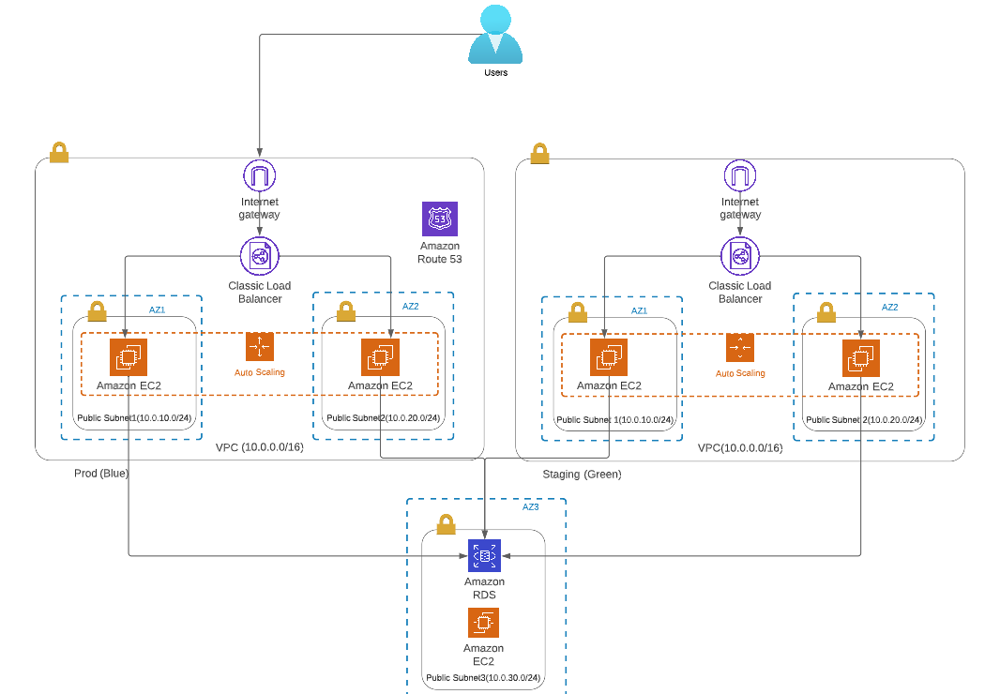

# mid-level-project
URL: https://petclinic.devdimaops.tech/

Blue/Green Deployment
- AWS:
  - EC2:
    - Classic Load Balancer
    - Auto Scalling Group
  - Route 53
  - RDS
  - CloudWatch
  - VPC
- Terraform
- Jenkins
- Ansible
- Docker

Associated repositories:
- https://github.com/unicum0212/ansible-roles-petclinic.git - repository with Ansible Roles.
- https://github.com/unicum0212/terraform-modules.git - repository with Terraform modules, i took from there module for security group and module with Load Balancer, Auto Scaling Group, CloudWatch alarms.
- https://github.com/unicum0212/petclinic-java.git - repository with PetClinic Application.
